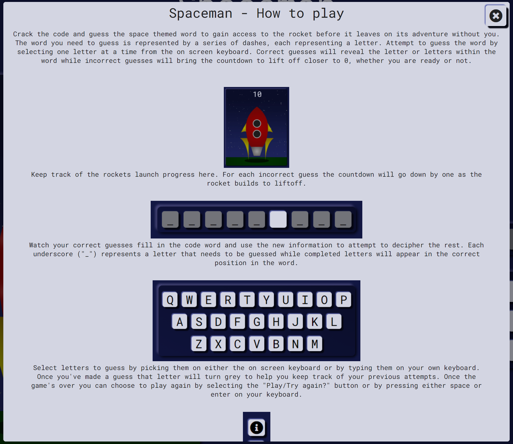
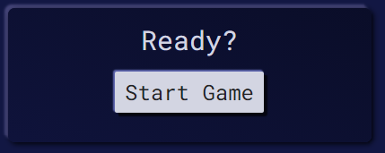

# __SPACEMAN__ - WEB BASED GAME

 ### Code Institute Milestone Project 2 HTML/CSS/JAVASCRIPT - Interactive Front-End Development

    

## __About the game__

 Spaceman is a space themed variant of the popular pen and paper game "Hangman". Crack the code and guess the space themed word to gain access to the rocket before it leaves on its adventure without you. The word you need to guess is represented by a series of dashes, each representing a letter. Attempt to guess the word by selecting one letter at a time from your keyboard or by clicking the keyboard on screen. Correct guesses will reveal the letter or letters within the word while incorrect guesses will bring the countdown to lift off closer to 0, whether you are ready or not.

 [Spaceman - Live site](https://chronologic12.github.io/spaceman/)

    

## __Table of contents__

 * [UX design](#ux-design)
    * [Project Goals](#project-goals)
    * [User Stories](#user-stories)
    * [Wireframes](#wireframes)
    * [Layout and Responsive Design](#layout-and-responsive-design)
    * [Colours and Fonts](#colours-and-fonts)
 * [Features](#features)
    * [Start Screen](#start-screen)
    * [Navigation](#navigation)
    * [Rocket Launch Progress](#rocket-launch-progress)
    * [Target Word](#target-word)
    * [Game Controls](#game-controls)
 * [Testing](#testing)
 * [Deployment](#deployment-github-pages)
 * [Credits](#credits)

 #### Developer note - For javascript code please see the library folder at /assets/js/lib/

## __UX design__

 ### Project Goals

 The aim of this project is to produce an interactive, fun and interesting space themed game for ages 7+. 
 The game should  - 
  * Have clear visuals.
  * Be simple and easy to interact with.
  * Have a short and engaging game play loop with good replay value.
  * Help children to learn both basic keyboard and mouse skills as well as new words.

 ### User Stories

 #### As a young player of this game - 
  * I want the game to be easy to understand and fun to play.
  * I want the game to look good and be visually responsive to my input.
  * I want the experience to be smooth and satisfying at all times. 

  #### As a responsible adult showing my dependant(s) this game - 
  * I want the game to be engaging and entertaining and have good replay potential. 
  * I want all aspects to be age appropriate for a younger player.
  * I want the game to have some educational value.
  * I want the game to be challenging enough for my dependant but achievable.

 ### Wireframes

The wireframes include page layouts for desktop, tablet and mobile screens with instances of the victory screen and error 404 page shown in tablet scaling.

 * [Desktop](assets/images/readme-images/spaceman-desktop.png)
 * [Tablet](assets/images/readme-images/spaceman-tablet.png)
 * [Tablet Victory screen](assets/images/readme-images/spaceman-tablet-win.png)
 * [Error 404 page](assets/images/readme-images/spaceman-tablet-404.png)
 * [Mobile](assets/images/readme-images/spaceman-mobile.png)

  ### Layout and Responsive design

  The page consists of the Header/nav section at the top of the page, along with the three main sections that make up the game space. These sections are - 
  * Rocket launch progress: This section contains -
    * The rocket image which will change to represent the current state of the game. 
    * The launch countdown which acts as a counter for the players remaining guesses.
    * Animated stars background. 
  * Target word: This section represents the word which the player needs to guess. 
  * Game controls: This section is how the player interacts with the game and alters depending upon game state. 

  For vertically oriented screens the game elements are stacked atop one another in a column design ideal for tablet and mobile devices. For devices in landscape orientation the target word and keyboard elements are to the right of the rocket image to make better use of the horizontal space.

  ### Colours and Fonts

  The colours used were chosen to help differentiate the background and foreground elements. The brighter reds and yellows of the rocket and the off white of the tiles contrast with the dark blues of the background drawing attention to these elements. The tiles and game sections also have a subtle box shadow giving them a slight 3d effect upon the page further differentiating them from the background. All 'Active' tiles light up when hovered, changing to a brighter white with a different box shadow, giving tactile feedback to the player. Along with having no hover animation, 'Inactive' tiles are of a darker off white and less distinct box shadow. This makes it easy for players to determine what aspects of the game are currently interactive and which aren't. 
  The font used throughout is 'Roboto Mono'. This font is clear and easy to read and has a style that I feel fits well with the space aesthetic. 

## __Features__

  ### Start Screen
   * On load the page will display a simple start screen showing the rocket in its starting position on a starry background as well as a prompt for the player to select 'Start Game' when they are ready to proceed. 

  

  
  

  
  ### Navigation
  * The nav section contains fixed position controls that are accessible at all times regardless of the game state. It contains a restart button which will reset the game and select a new target word and an information button which will bring up a modal with game play instructions and a link to the GitHub repository.

  

  
  

   * The information modal contains a short description of the game and each of its components to help players understand their aims and how to interact with each section. It also contains screenshot of the main gameplay sections for further clarification.

  

  
  

  * By default the instructions modal will open when the game is started but can be toggled not to appear on refresh with a checkbox at the bottom of the section. 

  

  
  

  ### Rocket Launch Progress
  * The Rocket section contains both the image depicting the current launch progress of the rock and the launch countdown which function as a 'Remaining guesses' counter for the player. The counter begins at 10 and immediately changes to 9 when the player selects to start the game to indicate the countdown has started. 

  The potential rocket images are as follows (left to right, top to bottom) -

  1. Idle
  2. Lights
  3. Smoke - light
  4. Smoke - heavy
  5. Boosters
  6. Game Loss
  7. Game Win
  8. Error 404

  

  
  

  ### Target Word
  * The target word section shows the player the number of characters in the word they need to guess as well as any spaces or other non letter characters contained in the word. It will also auto complete the word for the player in the case that they have not completed the word within the given number of guesses. The target word is selected at random from a list of over 100 words from a range of space related fields meaning most players should find themselves learning some new ones. 

    

    
    

  ### Game Controls
  * The game controls section is how the player will interact with the game. The contents change depending on game state allowing the user to start the game, select the letters they wish to guess and choose to play again on either the win or loss game states. While selecting letters, the game displays the options in the format of a qwerty keyboard. This should help younger players to become more familiar with using this standard layout. 

  

  
  

  

  
  

  

  
  

  

  
  

## __Testing__

Please see the [Testign documentation](TESTING.md) for full information.

## __Deployment GitHub Pages__
 
  The site was deployed through GitHub Pages using the following steps.
  * Navigate to the GitHub repository and select the Settings tab
  * Select the Pages section
  * Use the dropdown menu in the source section to select the Master Branch. Click save.
  * Once the branch has been selected the page will update displaying: "Your site is published at https://chronologic12.github.io/spaceman/"

## __Credits__

  ### Content
  * [Font Awesome](https://fontawesome.com/) was used for SVG icons. 
  * [Google fonts](https://fonts.google.com/) Was used to link used fonts.
  * [jQuery](https://jquery.com/) for simple document traversal.

  ### Media
  * All artwork was created by me with use of [Adobe Photoshop](https://www.adobe.com/uk/products/photoshop.html).
  * Animated star background was created by me with use of [Adobe After Effects](https://www.adobe.com/uk/products/aftereffects.html).
  * All images are served to the site [Cloudinary](https://cloudinary.com/console/c-087b7b36d5737750ed37ab5fb60479/getting-started) CDN for improved performance.

  ### Help and info
  * Code Institute learning material - general knowledge.
  * [Codecademy](https://www.codecademy.com/learn) - general knowledge.
  * [w3schools](https://www.w3schools.com/) - general knowledge.
  * [MND Web Docs](https://developer.mozilla.org/en-US/) - general knowledge.
  * [Stack Overflow](https://stackoverflow.com/) - debugging. 
  * Collapsible modal was designed with help from [this article](https://www.w3schools.com/howto/howto_css_modals.asp) on W3schools.
  * To disable the right click event I followed [this guid](https://www.w3docs.com/snippets/javascript/how-to-disable-text-selection-copy-cut-paste-and-right-click-on-a-web-page.html) on W3docs.
  * Box shadow soft UI tiles were created with help from [Neumorphism.io](https://neumorphism.io/#dedfe8).