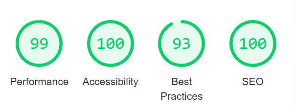

# __SPACEMAN__ - WEB BASED GAME
 
 ### Code Institute Milestone Project 2 HTML/CSS/JAVASCRIPT - Interactive Front-End Development
 
<p align="center">
    
</p>
 
[README.md](README.md)
 
[Live Site](https://chronologic12.github.io/spaceman/)
 
## __Table of contents__
 
* [User Stories Testing](#user-stories-testing)
* [User Testing](#user-testing)
* [Performance](#performance)
* [Code Validation](#code-validation)
* [Cross Browser](#cross-browser)
* [Responsive Design](#responsive-design)
* [Bugs](#bugs)
 
## __Testing__
 
### __User Stories Testing__
 
#### __As a young player of this game__ - 
  1. *I want the game to be easy to understand and fun to play.*
      1. By default the game instructions open on game start to clarify how to play and the purpose of each section.
      <p align="center">
      
      </p>
      2. Clear visual hierarchy makes identifying interactive elements easy.
      3. Based on the classic pen and paper game Hangman, Spaceman is all the fun of the classic version but removes set up between rounds and can be played single player or multiplayer.
  2. *I want the game to look good and be visually responsive to my input.*
      1. The game centers around the rocket launch progress section which uses simple shapes and contrasting colours to be visually appealing.
      <p align="center">
      
      </p>
      2. The animated star background adds an appealing sense of depth and motion to the section.
      3. Images update as the player makes guesses to show how close the rocket is to lift off.
      4. All letter elements have hover animations and grey out when the player has selected them so they can keep track of previous guesses.
      5. The target word section is filled in with each correct guess and will complete itself to reveal the word to the player in the case of a game loss.   
  3. *I want the experience to be smooth and satisfying at all times.*
      1. All interactive elements give visual feedback so as to be responsive and satisfying to players.
      <p align="center">
      
      </p>
      2. Players can choose to use either the on screen keyboard or their own keyboard to select letters depending upon their preference.
      3. Right clicking and highlighting are disabled within the gamespace to avoid accidental clicks detracting from gameplay.
 
### __As a responsible adult showing my dependant(s) this game__ - 
  1. *I want the game to be engaging and entertaining and have good replay potential.*
      1. The engaging visuals, responsive feedback of game elements and simple gameplay loop make this entertaining and encourage replay.
  2. *I want all aspects to be age appropriate for a younger player.*
      1. All words and images are related to the game's space theme and are appropriate for the target audience. 
      2. The game's space theme removes the somewhat morbid visuals of the game's inspiration, Hangman, making it more suitable for young players. 
  3. *I want the game to have some educational value.*
      1. The list of words from which the game selects the player's target word is over 100 words long, all related in some way to space. Playing this game will therefore expose players to a wide range of words relating to the game's theme and expand their lexicon.  
  4. *I want the game to be challenging enough for my dependant but achievable.*
      1. The game features target words at a wide range of difficulties as therefore presents a range of challenge difficulty to the player. The number of simpler words means players should encounter easier challenges every few rounds. 
 
### __User Testing__
  During a short series of over the shoulder user tests I discovered several areas which could be improved. These were - 
  * Young testers were sometimes having trouble with accidental highlighting of elements or opening the right click menu. To remove this potential annoyance for the player I have disabled both highlighting and rick click actions.
  * During a short play test users were experiencing the same word on multiple rounds. The original count of words that could be randomly selected was approximately 40 which proved to be too few to provide enough variation. To counter this I have increased the count to over 100.
 
### __Performance__
 
  Site performance was tested using Google Chrome's Lighthouse tools in which it scored above 90 in all categories for both desktop and mobile.
 
  #### __Desktop__
  <p align="center">
    
  </p>
 
  #### __Mobile__
  <p align="center">
    
  </p>
 
  ### __Code Validation__
  All CSS was tested using [W3C Validator](https://jigsaw.w3.org/css-validator/#validate_by_input) and returned no errors.
 
  <p align="center">
    
  </p>
 
  All HTML was tested using [Nu HTML Checker](https://validator.w3.org/nu/) and returned no errors.
 
  <p align="center">
    
  </p>
 
  Javascript linting was handled by [ESLint](https://eslint.org/).
 
  ### __Cross Browser__
 
  Cross browser testing was carried out through the [crossbrowsertesting](https://app.crossbrowsertesting.com/test-center) web application. Through this app I was able to run a series of tests for each of the following browsers - 
   * Google Chrome
   * Mozilla Firefox 
   * Microsoft Edge
   * Opera 
 
  For each browser I conducted the following tests - 
   * Load page with empty local storage and ensure the instruction modal opens by default.
   * Toggle off 'showInstructionsOnStart' and reload the page. Ensure with toggle off that the modal does not open.
   * Check manual open and close of instruction modal.
   * Check the github repository link in modal opens to a new page and to the correct location.
   * Test manual restart button clears current progress, resets all styling and selects new target word.
   * Select letters via on screen keyboard, ensure styling change of selected letter and filling of target word where appropriate.
   * Select letters via peripheral keyboard, ensure styling change of selected letter and filling of target word where appropriate.
   * Gameplay loop - Loss
      * Play game through to loss and ensure correct rocket images and countdown number is shown at each stage.
      * Upon running out of guesses, ensure that the correct image and game state message is shown.
      * Test 'Try Again?' button from the loss screen clears current progress, resets all styling, reconstructs the on screen keyboard and selects a new target word.
  * Gameplay loop - Win
      * Play the game through to win and ensure correct rocket images and countdown number is shown at each stage.
      * Upon completion of the target word, ensure that the correct image and game state message is shown.
      * Test 'Play Again?' button from the win screen clears current progress, resets all styling, reconstructs the on screen keyboard and selects new target word.
  * For testing gameplay loops, run multiple times and test restart buttons via button clicks and via selection of the space and enter keys.
  * Direct to invalid page address and ensure that you are directed to the Error 404 page.
  * Check button on the Error 404 page returns you to the game. 
 
  No errors were found on any of the browsers tested.
 
  #### __Google Chrome__
 
  <p align="center">
    
  </p>
 
  #### __Microsoft Edge__
 
  <p align="center">
    
  </p>
 
  #### __Mozilla Firefox__
 
  <p align="center">
    
  </p>
 
  #### __Opera__
 
  <p align="center">
    
  </p>
 
 
  ### __Responsive Design__
 
  Comprehensive testing of the responsive design of the site was done through Chrome Dev Tools and [responsivetesttool.com](http://responsivetesttool.com/). Responsivetesttool simulates how the site would display on most popular devices and device types. Using these tools I was able to test the design on a huge range of screen sizes and have included an example each for mobile, tablet, laptop and desktop devices.
  
  For each device I was checking for
  * Clearly legible text
  * No overlapping game elements
  * Consistent styling
 
  Mobile - 360 x 640px
  <p align="center">
    
  </p>
 
  Tablet - 768 x 1024px
  <p align="center">
    
  </p>
 
  Laptop - 1024 x 600px
  <p align="center">
    
  </p>
 
  Desktop - 1920 x 1080px
  <p align="center">
    
  </p>
 
  ### __Bugs__
 
* Opening modal on start is working inverse to intention, e.g. not opening on page load unless the modal checkbox is toggled off.  
  * Checked with Dev tools and discovered I had no functionality to set the initial value in local storage for showInstructionsOnStart. I rectified this by checking on page load if the value of showInstructionsOnStart is equal to "null" which is only true if it has not been assigned a value and setting this to the desired default value of "true". 
  ```
  if (localStorage.getItem("showInstructionsOnStart") === null) {
      localStorage.setItem("showInstructionsOnStart", "true");
  }
  ```
 
***
 
*  Images displaying on testing in the development environment not displaying when deployed to github pages. 
    * The fault was due to improper use of file paths and as I was already planning to serve images to the site via a CDN (Cloudinary), implementing this rectified the issue. 
 
***
 
* When attempting to add the ability for players using their own keyboard to select letters to restart the game from the same input device, binding the event listeners on page load meant that clicking these buttons (space and enter) at any time would cause the round to restart.  
    * Checking in the jQuery documentation I found the 'one' event handler attachment which unbinds the event listener after its first invocation. I could then bind the event listeners only when entering the relevant game state and they would not be active during gameplay.
 
    ```
    const bindReplayHandlers = () => {
    $(document).one("keydown", function (event) {
        if (event.which === 32 || event.which === 13) {
            resetGame();
        }
      });
    };
    ```
  
  ***
 
* Players can select letters from peripheral keyboard before they have selected to start the game.
    * This was due to event listeners being bound on page load. I have moved the function to bind keyboard event listeners to run when the game is started by the player. 
 
***
 
* 'Try Again?' restart button from game loss screen not resetting game as intended
    * I checked the problem with dev tools and found that the error was due to missing 'Restart' class value. Added the class and resolved the issue. 
 
***